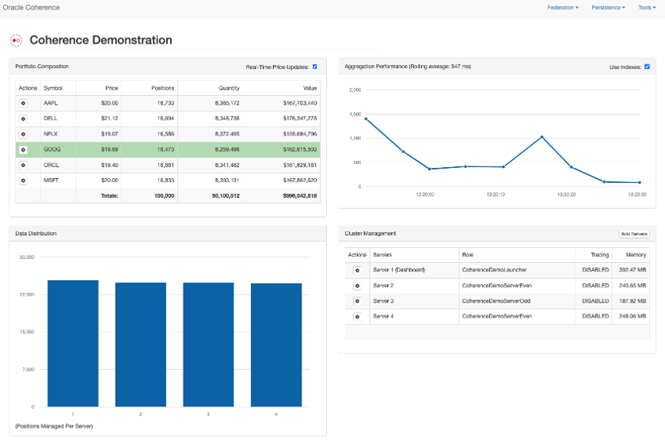
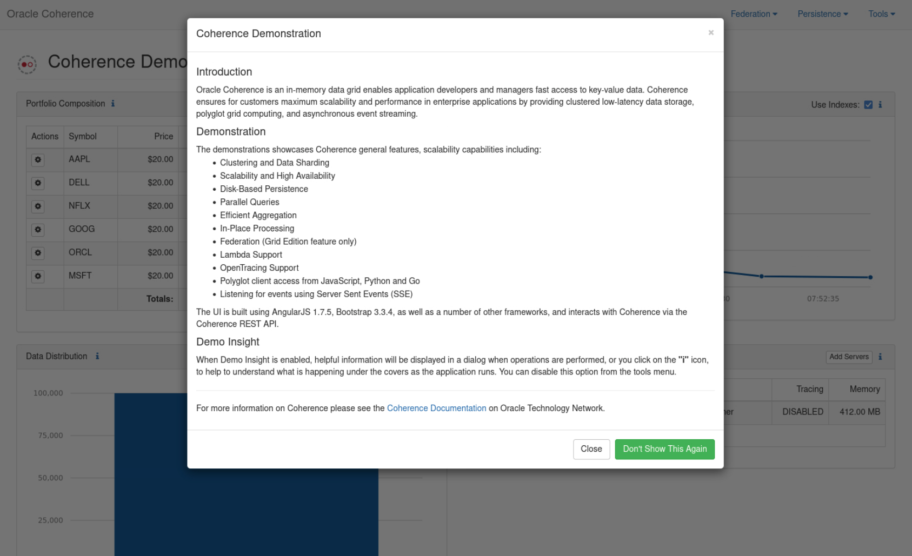
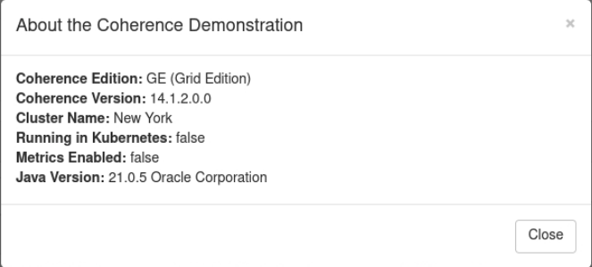
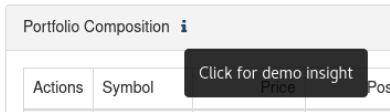

# Explore the Demonstration Application

## Introduction

This lab walks you through starting the fictitious stock application and exploring application functionality.

The application is web-based, using Angular and Bootstrap, with the UI accessing Coherence via JAX-RS endpoints.
For this Lab it is run standalone on a VM but can also be deployed to Kubernetes via the Coherence Operator.

The application uses the “Oracle Bedrock” framework to start/stop additional Coherence processes as well as a secondary cluster for Federation.

By default, the application uses Coherence Community Edition (CE), but for the purposes of this demonstration we are running it using Grid Edition (14.1.2.0.0) 
to showcase Federation capabilities.



Estimated time: 20 minutes

### Objectives

In this lab, you will:

* Start the application
* Explore application “Insight”
* Add and split trades 
* Scale and shrink the Coherence cluster
* Listen for events

### Prerequisites
     
This lab assumes you have:

* An Oracle Free Tier(Trial), Paid or LiveLabs Cloud Account
* You have completed:
  * Lab: Prepare Setup (Free-tier and Paid Tenants only)
  * Lab: Initialize Environment
     
The following has already been setup in this VM:

1. The application has been cloned from the GitHub repository `https://github.com/coherence-community/coherence-demo`.
2. JDK21 and Maven version 3.8.8 has already been installed
3. The application has already been built using Maven

## Task 1: Start the Application
 
1. Open a new terminal and change to the `coherence-demo` directory and verify the environment.

   ```bash
   cd ~/coherence-demo
   mvn -v
   ```   
   
   You will have output similar to the following:

   ```bash
   Apache Maven 3.8.8 (4c87b05d9aedce574290d1acc98575ed5eb6cd39)
   Maven home: /home/opc/Downloads/apache-maven-3.8.8
   Java version: 21.0.5, vendor: Oracle Corporation, runtime: /usr/lib/jvm/jdk-21.0.5-oracle-x64
   Default locale: en_US, platform encoding: UTF-8
   OS name: "linux", version: "5.15.0-104.119.4.2.el8uek.x86_64", arch: "amd64", family: "unix"
   ```   

2. In the same terminal, issue the following command to start the application:

    ```bash
   mvn exec:exec -P grid-edition
   ```
   
   You should see a screen similar to the following showing the welcome message. Click `Close` to continue.

   

3. View the application home page.

   In the browser window, you will see four application panels.

   1. Top left or "Portfolio Composition" shows the different stock symbols with fictitious prices
   2. Top right or "Aggregation Performance" shows the time taken to retrieve the aggregated data for the first panel
   3. Bottom left or "Data Distribution" shows the data distribution of the stock data amongst members
   4. Bottom Right or "Cluster Management" shows the current members and allows you to start and stop members 
            
4. There are also three menus, `Federation`, `Persistence` and `Tools` that we explore later.

5. Use the `Tools` menu and select `About`. This will show a screen similar to the following with information about the application including the Coherence version.
   
   

## Task 2: Explore application “Insight”

1. "Insight" Icons   
   Throughout the application, there are small *i* icons which allows you to view "Insight" into different application aspects.
   For example, the following insight icon on the "Portfolio Composition" panel, shows the code that is run to aggregate the portfolio.

   

2. After each operation, such as adding trades or starting servers for example, "Insight" is also displayed to explain the operation or
   show relevant code.

3. If you wish to disable "Insight" entirely, choose `Tools` -> `Disable Insight`. You can re-enable it in the same menu.

## Task 3: Add and split trades
   
In this task we will add trades, and 


## Task 4: Scale and shrink the Coherence cluster


## Task 5: Listen for events


## Learn More
            
* [Coherence Demo Source](https://github.com/coherence-community/coherence-demo)
* [Coherence Operator for Kubernetes](https://github.com/oracle/coherence-operator)
* [Oracle Bedrock framework](https://github.com/coherence-community/oracle-bedrock)  

## Acknowledgements

* **Author** - Tim Middleton
* **Contributors** - Ankit Pandey, Sid Joshi
* **Last Updated By/Date** - Ankit Pandey, November 2024