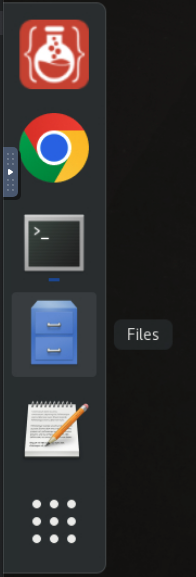
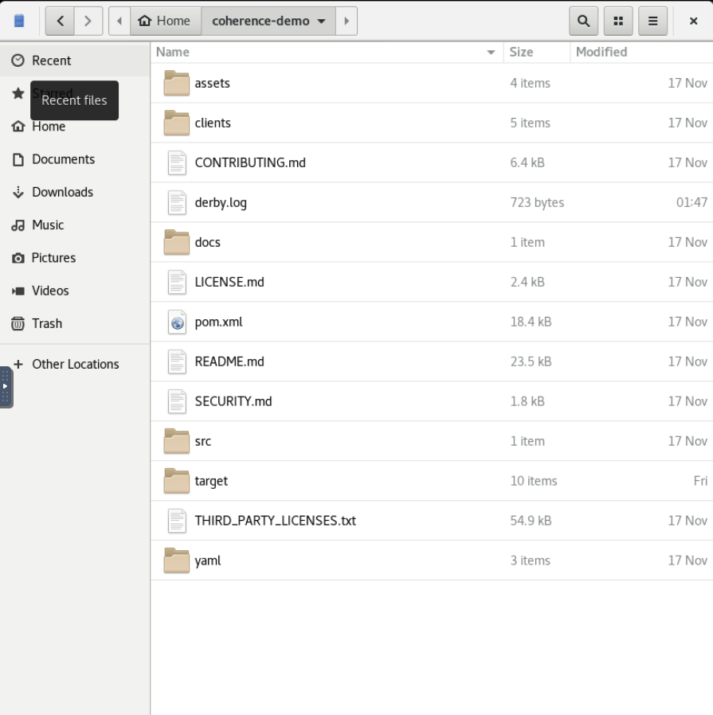

# Explore the Application Code

## Introduction

This lab walks you through the application code allowing you to gain an understanding of how the code works.

> Note: You can choose any of the languages you wish to inspect.

Estimated time: 30 minutes

### Objectives

In this lab, you will:

* Explore Java code
* Explore Python Code
* Explore JavaScript Code
* Explore Go Code

### Prerequisites

* You should have completed the previous labs.

## Task 1: Open the code in the "Files" application

1. In the remote session, choose `Activities` and select the `Files` icon to open the "Files" application.
     
   
        
2. Double click `coherence-demo` to change to that directory.

   

## Task 2: Explore the Java Code

There are various components to the Java based JAX-RS application. You can explore the various classes and packages below via the explorer or via the 
direct GitHub links.

> Note: Not all source or configuration files are displayed, just some that showcase important components.

**Source Files**

| Package                                             | Class                     | Usage                                          | GitHub Link                                                                                                                                                                |
|-----------------------------------------------------|---------------------------|------------------------------------------------|----------------------------------------------------------------------------------------------------------------------------------------------------------------------------|
| src/main/java/com/oracle/coherence/demo/application | BootstrapInterceptor.java | Code executed on startup                       | [BootstrapInterceptor.java](https://github.com/coherence-community/coherence-demo/blob/1412/src/main/java/com/oracle/coherence/demo/application/BootstrapInterceptor.java) |
| src/main/java/com/oracle/coherence/demo/application | ChartDataResource.java    | JAX-RS Endpoint to carry out data aggregation  | [ChartDataResource.java](https://github.com/coherence-community/coherence-demo/blob/1412/src/main/java/com/oracle/coherence/demo/application/ChartDataResource.java)       |
| src/main/java/com/oracle/coherence/demo/application | EventsResource.java       | JAX-RS Endpoint to listen for events           | [EventsResource.java](https://github.com/coherence-community/coherence-demo/blob/1412/src/main/java/com/oracle/coherence/demo/application/EventsResource.java)             |
| src/main/java/com/oracle/coherence/demo/application | Utilities.java            | JVarious utilities for working with cache data | [Utilities.java](https://github.com/coherence-community/coherence-demo/blob/1412/src/main/java/com/oracle/coherence/demo/application/Utilities.java)                       |
| src/main/java/com/oracle/coherence/demo/cachestore  |                           | Contains cache store JPA Code                  | [Link](https://github.com/coherence-community/coherence-demo/tree/1412/src/main/java/com/oracle/coherence/demo/cachestore)                                                 |
| src/main/java/com/oracle/coherence/demo/model       |                           | Contains cache model classes                   | [Link](https://github.com/coherence-community/coherence-demo/tree/1412/src/main/java/com/oracle/coherence/demo/model)                                                      |

**Configuration Files**  
 
| File                                             | Usage                                        | Usage                                                       | GitHub Link                                                                                                                                                     |
|--------------------------------------------------|----------------------------------------------|-------------------------------------------------------------|-----------------------------------------------------------------------------------------------------------------------------------------------------------------|
| src/main/resources/cache-config-grid-edition.xml | cache-config-grid-edition.xml                | Contains cache config for federation scheme and cache store | [cache-config-grid-edition.xml](https://github.com/coherence-community/coherence-demo/blob/1412/src/main/resources/cache-config-grid-edition.xml)               |
| src/main/resources/cache-config-grid-edition.xml | tangosol-coherence-override-grid-edition.xml | Contains override config for federation setup               | [ache-config-grid-edition.xml](https://github.com/coherence-community/coherence-demo/blob/1412/src/main/resources/tangosol-coherence-override-grid-edition.xml) |
| src/main/resources/web                           | HTML and JavaScript for web application      |                                                             | [Link](https://github.com/coherence-community/coherence-demo/tree/1412/src/main/resources/web)                                                                  |

    
## Task 3: Explore the Python Code

The Python code is available in the following location:
  
* clients/py/main.py
* [main.py](https://github.com/coherence-community/coherence-demo/blob/1412/clients/py/main.py)

## Task 4: Explore the Javascript Code

The JavaScript code is available in the following location:
  
* clients/js/main.js
* [main.js](https://github.com/coherence-community/coherence-demo/blob/1412/clients/js/main.js)                       

## Task 5: Explore the Go Code

The Go code is available in the following location:
  
* clients/go/main.go
* [main.go](https://github.com/coherence-community/coherence-demo/blob/1412/clients/go/main.go)                       

## Acknowledgements

* **Author** - Tim Middleton
* **Contributors** - Ankit Pandey, Sid Joshi
* **Last Updated By/Date** - Ankit Pandey, November 2024